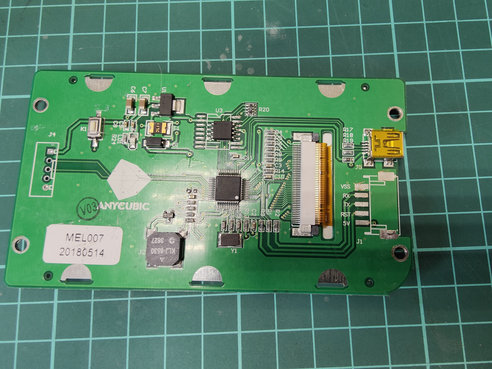
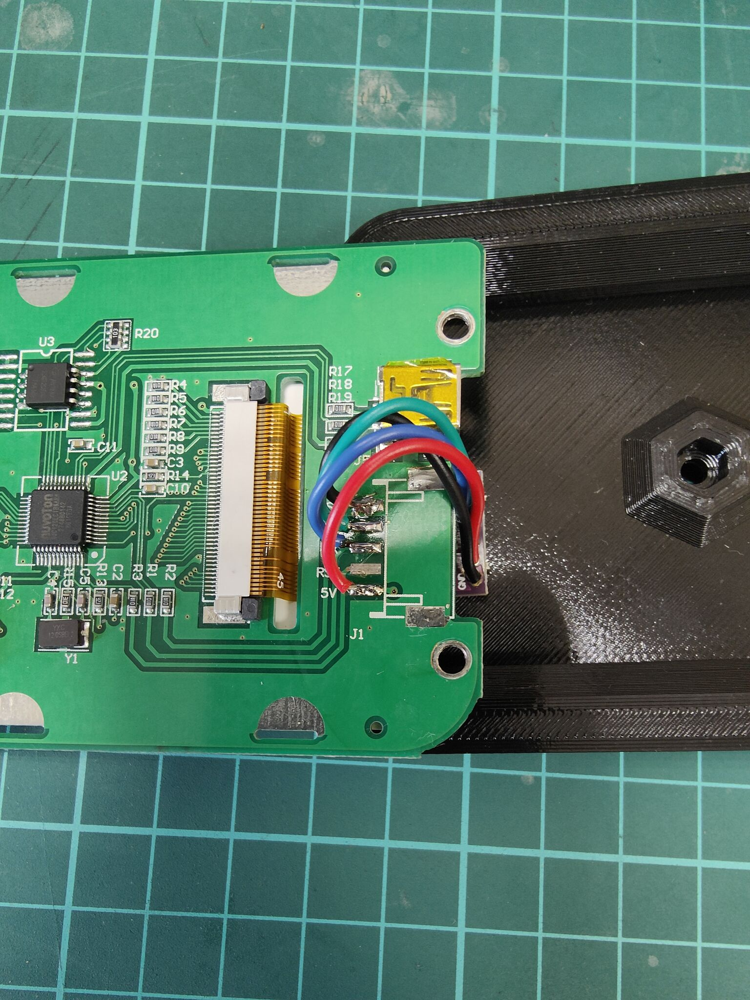
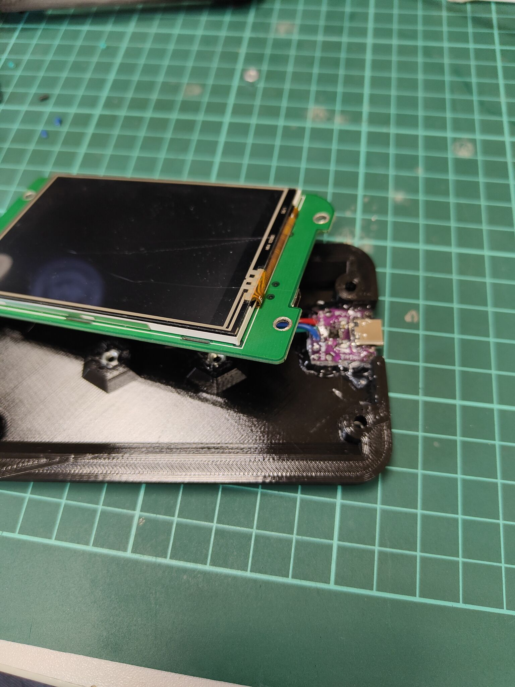

Overview:
---
The first aim of this project is to reuse old Anycubic LCD's (dgus based) after you moved your Anycubic i3 Mega to klipper from Marlin.


Hardware:
---
1. Stock Anycubic i3 Mega LCD
2. [Cheap USB-UART converter](https://sl.aliexpress.ru/p?key=td6esys)
3. Printed case and some screws

Assembly advice:
---
Desolder connector to fit in the case:



Connect wires:
- LCD <-> USB-UART
- 5V <-> 5V
- VSS <-> GND
- RX <-> TX
- TX <-> RX



Use hot glue to fix all in place


Installing:
--
```
cd ~
git clone https://github.com/Ogurezzz/Moonraker-HMI.git
cd Moonraker-HMI
~/Moonraker-HMI/scripts/install.sh
```
Follow instruction on the scree to install single or multiple instances.
Script will install dependencies, compile binary and register as many daemons as you request. Usually you will nee only one service for one moonraker instance. Obviously you need separate LCD for each moonraker-hmi service instance.


Update:
---
```
cd ~/Moonraker-HMI
git pull
make
```
Restart service after update.

Config file example:
---
```
[connection]
hots: http://192.168.5.12:7125
#Your printer's address
serial: /dev/serial/by-id/usb-1a86_USB_Serial-if00-port0
#Serial port that appeared on the machine you connect LCD to.
```

Case
---
Great thanks to [DrPerryCoke](https://github.com/DrPerryCoke) for Case model.
